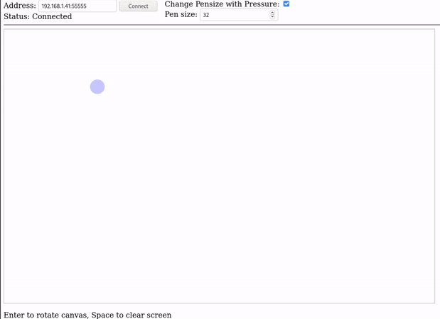

# Pipes and Rust

A small program that runs on your reMarkable 2 that allows you to draw on a tiny website hosted on the tablet itself.
No need to install anything else.

# Usage

1. Install the software with one of the methods below.
2. Connect to http://remarkable (or device IP)
3. Done!

# Requirements

1. SSH access to the reMarkable 2 for installation (passwordless ssh-key recommended)
2. (when building from source) [Rust](https://rustup.rs/)
3. (when building from source) [Cross](https://github.com/rust-embedded/cross)

# Installation (from Binary)

1. Download the [latest release](https://github.com/AnyTimeTraveler/pipes-and-rust/releases)
2. Set IP or hostname in `install.sh`
3. Run `install.sh` as normal user

# Installation (from Source)

1. Install [Rust](https://rustup.rs/)
2. Install [Cross](https://github.com/rust-embedded/cross) to build for armv7
3. Set hostname in `build_push_run.sh`
4. Execute `build_push_run.sh`

# Credits

This work is based on [pipes-and-paper](https://gitlab.com/afandian/pipes-and-paper) by Joe Wass and uses his code to read the stylus coordinates.

Thank you to [MarkPash](https://github.com/MarkPash) for adding the eraser function.

# License

MIT-License
